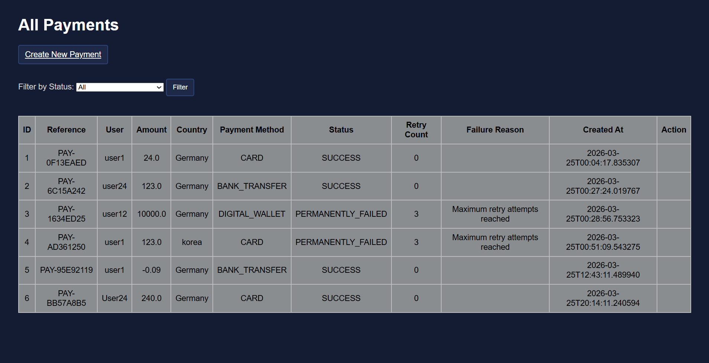
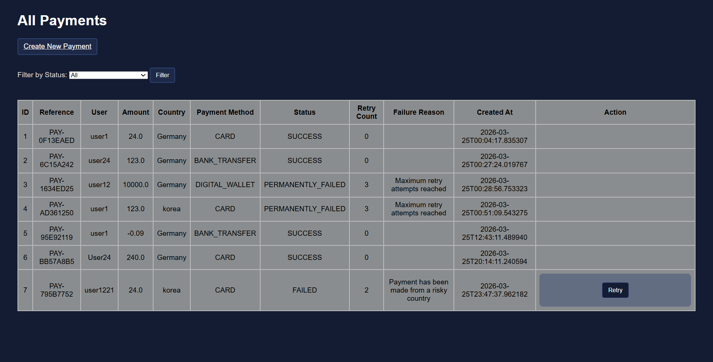

# Payment Retry Service

This is a backend project I coded using Java and Spring Boot to understand how real payment systems handle failures and retries. The goal was to move beyond basic CRUD and implement logic that reflects how actual payments are processed and also validated.

## Features
- Create and view payments through a web interface
- Retry failed payments with a limit of max 3 attempts
- Validate based on amount, payment method and country
- Status handling SUCCESS, FAILED or PERMANENTLY_FAILED
- Unit tests covering failure situations and basic edge cases

## Tech Stack
- Java
- Spring Boot
- Spring Data JPA
- H2 Database
- Thymeleaf
- JUnit


## How can you run it.
Step 1
```bash
git clone https://github.com/24prathameshmote-rgb/payment-retry-service.git
```

Step 2
```bash
cd payment-retry-service
```

Step 3

For Windows Users
```bash
.\mvnw.cmd spring-boot:run
```
For Linux/Mac Users
```bash
./mvnw spring-boot:run
```

Run this in your browser:   http://localhost:8081/payments


## This is how the web app looks on the 'Create Payment' page.


## This is how the web app looks on the 'All Payments' page. You can see it in a table format.




## This is how the web app looks when you entered an FAILED payment attempt. It shows the retry action.


